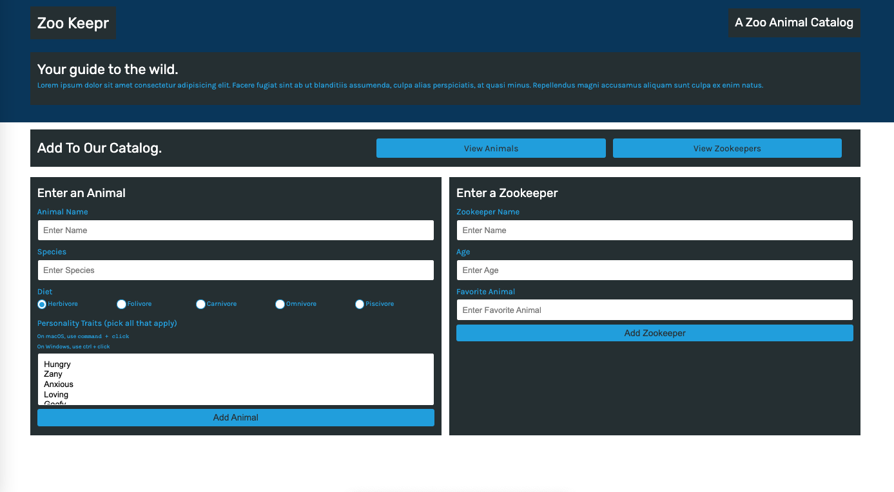

# zookeepr

&nbsp;  

## Description 

This is an online catalog for a zoo to keep track of any new animals that come in. They can use this tool to access data from different locations and browsers without needing to download it to their device. As their developer, I built a back-end for them and then connected it to their front-end to make their online catalog functional. 

&nbsp;  

## Tools 
* Node.js
* Express.js
* HTML
* CSS
* JavaScript
* Server-side API

&nbsp;  

## Screenshot

&nbsp;  

## Live Website
https://calm-stream-52878.herokuapp.com/

&nbsp;  

## Thank You
Please feel free to contact me with any additional questions: 
* GITHUB: https://www.github.com/winterkanda
* EMAIL: <mailto: kirankanda06@gmail.com>
### @2021 Winter
